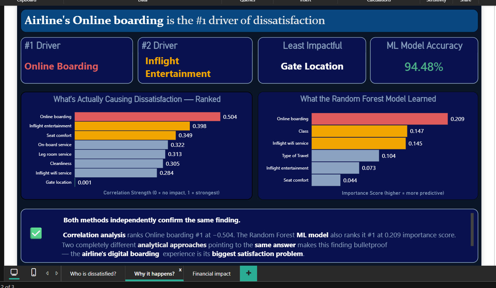
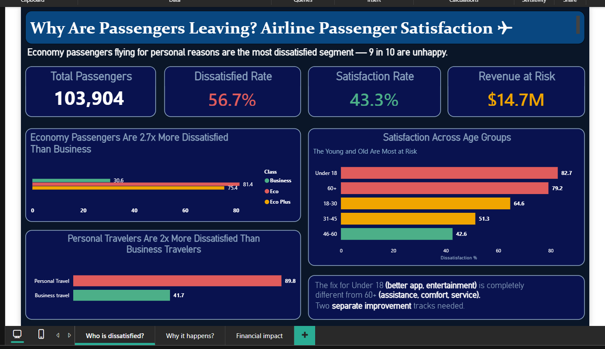
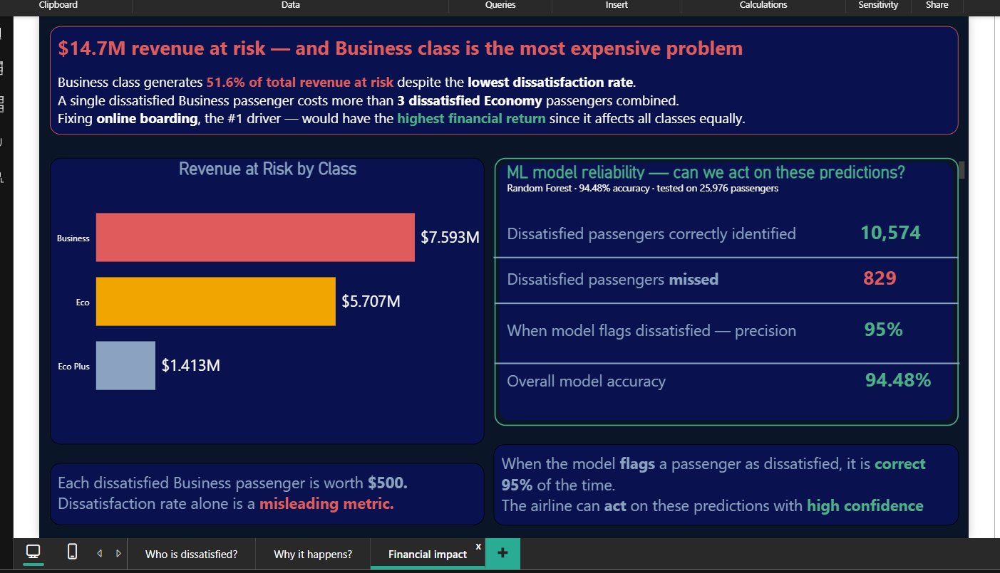

# Why Are Passengers Leaving? — Airline Passenger Satisfaction Analysis

   

> Economy passengers flying for personal reasons are the most dissatisfied segment — 9 in 10 are unhappy.

## 📊 Executive Summary

I analyzed **103,904 passenger records** to understand what drives airline dissatisfaction, built a machine learning model to predict it, and quantified the financial impact. The result: one fixable factor — online boarding — is the single highest-leverage lever the airline has, confirmed independently by both correlation analysis and a Random Forest model.

- **56.7% of passengers are dissatisfied**, putting **$14.7M in revenue at risk**
- **Online boarding is the #1 driver of dissatisfaction** — confirmed by two independent methods (correlation: -0.504, ML feature importance: 0.209)
- **A predictive model catches dissatisfaction with 94.48% accuracy**, correctly flagging 10,574 of 11,403 dissatisfied passengers

> **Bottom line:** Business class generates 51.6% of revenue at risk despite having the lowest dissatisfaction rate — fixing online boarding matters more than any single class-specific fix, because it affects every passenger segment equally.

## 🛠️ Tools Used

- **Python** (pandas, numpy, matplotlib, seaborn, scikit-learn) — data cleaning, EDA, and ML modeling
- **SQL** (SQLite) — business question queries
- **Power BI** — interactive 3-page dashboard

## 📁 Dataset

- **Source:** Airline Passenger Satisfaction dataset (Kaggle)
- **Scope:** 103,904 training records · 25,976 test records · 25 features

## ▶️ How to Run

**Prerequisites**
```
pip install -r requirements.txt
```

**Steps**
1. Clone the repository:
   ```
   git clone https://github.com/Likhitha37/airline-passenger-satisfaction.git
   ```
2. Ensure `train.csv` and `test.csv` are in the `data/` folder (already included in this repo).
3. Run the notebooks in order:
   - `01_eda.ipynb` — exploratory analysis
   - `02_sql_analysis.ipynb` — SQL business questions
   - `03_ml_model.ipynb` — Random Forest model training and evaluation
4. Open `dashboard/airline_dashboard.pbix` in Power BI Desktop to view the interactive dashboard.

## 🔍 Key Findings

### 1. Economy passengers are 2.7× more dissatisfied than Business
Business class dissatisfaction sits at just **30.6%**, while Economy and Eco Plus sit at **81.4%** and **75.4%**. The class gap is enormous.

### 2. Personal travelers are 2× more dissatisfied than business travelers
**89.8%** of personal travelers report dissatisfaction, compared to **41.7%** of business travelers.

### 3. The youngest and oldest passengers are most at risk
Under-18 (**82.7%**) and 60+ (**79.2%**) passengers show the highest dissatisfaction. These two groups likely need entirely different fixes — better app/entertainment for younger passengers, more assistance and comfort for older ones.

### 4. Online boarding is the #1 driver — confirmed two ways
Correlation analysis ranks online boarding **#1 at -0.504**. The Random Forest model independently ranks it **#1 at 0.209 importance**. Two different analytical methods agreeing is strong evidence, not coincidence.



### 5. Business class is the most expensive dissatisfaction problem
Despite having the **lowest** dissatisfaction rate, Business class accounts for **$7.59M of the $14.7M** revenue at risk — because a dissatisfied Business passenger costs more than 3 dissatisfied Economy passengers combined.

**Putting it together:** the data tells a clear story — dissatisfaction isn't evenly spread, but its *cause* is. Online boarding is the one factor that affects every class and every age group equally, which is exactly why fixing it has the highest financial return of any single intervention.

## 🤖 Machine Learning Model

I trained a **Random Forest Classifier** to predict passenger dissatisfaction, tested on 25,976 held-out passengers.

| Metric | Value |
|---|---|
| Overall Accuracy | **94.48%** |
| Precision (when model flags dissatisfied) | **95%** |
| Dissatisfied passengers correctly identified | 10,574 |
| Dissatisfied passengers missed | 829 |

When the model flags a passenger as dissatisfied, it's right 95% of the time — reliable enough for the airline to act on with confidence.

## ⚠️ Limitations

- **Class imbalance risk:** With 56.7% of passengers dissatisfied, the model isn't working against a rare-event problem, but performance should still be monitored if the airline's actual satisfaction rate shifts over time.
- **Feature importance ≠ causation:** Online boarding ranking #1 in both methods is strong evidence of association, but doesn't prove that fixing it *alone* would reduce dissatisfaction by a specific amount — a controlled test would be needed to confirm the causal impact.
- **Revenue-at-risk assumptions:** The $14.7M figure assumes a fixed revenue value per class (Business/Eco Plus/Economy). Real-world revenue impact would vary by route, season, and rebooking behavior.
- **What I'd do differently:** With more time, I'd run an A/B test on an improved online boarding flow to measure the actual before/after change in dissatisfaction, rather than relying on model-based inference alone.

## 💡 Business Recommendations

1. **Fix online boarding first** — it's the highest-leverage, most equally-distributed driver of dissatisfaction across all classes and ages.
2. **Build two separate improvement tracks** for Under-18 and 60+ passengers — their dissatisfaction drivers are different (entertainment/app vs. assistance/comfort) and a one-size-fix won't work for both.
3. **Prioritize Business class retention** — losing a Business passenger costs 3× as much as losing an Economy passenger, even though Business has the lowest dissatisfaction rate.

## 📈 Dashboard

| Who is Dissatisfied? | Why it Happens? | Financial Impact |
|---|---|---|
|  |  |  |

*Full interactive dashboard: `dashboard/airline_dashboard.pbix`*

## 📂 Project Structure

```
airline-passenger-satisfaction/
├── notebook/
│   ├── 01_eda.ipynb
│   ├── 02_sql_analysis.ipynb
│   └── 03_ml_model.ipynb
├── sql/
│   └── analysis_queries.sql
├── data/
│   ├── train.csv
│   ├── test.csv
│   ├── cleaned_data.csv
│   ├── correlations.csv
│   ├── feature_importance.csv
│   └── revenue_summary.csv
├── dashboard/
│   ├── airline_dashboard.pbix
│   └── screenshots/
│       ├── dashboard_page1_who.png
│       ├── dashboard_page2_why.png
│       └── dashboard_page3_financial.png
├── requirements.txt
└── README.md
```
